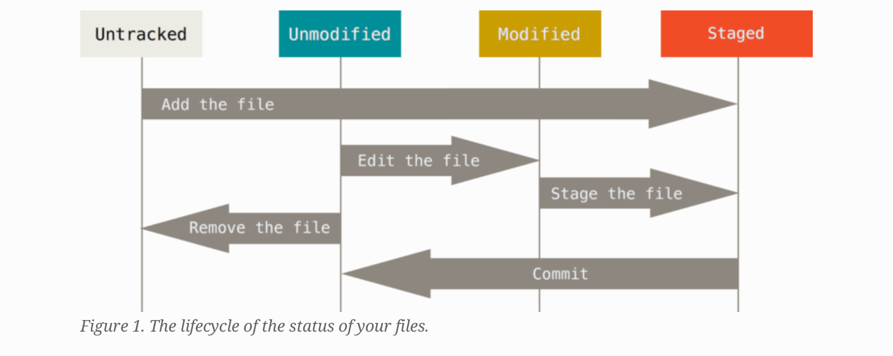

# Git Workship

## Introduction
**What is git?**


## installing git
##### Installing on Linux
```shell
$ sudo dnf install git-all
# or
$ sudo apt install git-all
# or
$ sudo apt install git
```

##### Installing on Windows
install git bash


## First-Time Git Setup
```$ git config --list --show-origin
$ git config --global user.name your_name
$ git config --global user.email youremail@example.com
```


### Checking your settings
`git config --list`<br>
You can also check values for specific keys with<br> `git config <key:>`<br>
`git config user.name`<br>
`John Doe`<br>


## Getting help
if you ever need help using git, there are three ways to get help
`$git help <verb>`<br>
`$git <verb> --help`<br>
`man git-<verb>`

###### for example
`git help config`<br>


# Git Basics

You can obtain a Git repository in on of two ways
<ol>
	<li>You can turn local directory into a git repository</li>
	<li>You can clone an existing Git repository from elsewhere</li>
</ol>

#### Initializing a Repository in an Existing Directory
`$ cd ~/Desktop/`<br>
`$ mkdir gitBasics && cd gitBasics`<br>
`$ git init`<br>


### Lifecycle of files in Git


**Adding a file to staging**<br>
```shell
$ git add *.c<br>
$ git add LISENCE<br>
$ git commit -m "initial project version"<br>
```


**To add all the files at once**
`$git add .`


#### Checking status of your Files
```shell
$git status<br>
On branch master
Your branch is up-to-date with 'origin/master'.
nothing to commit, working directory is clean
#it means that none of the tracked files are modified
```


**Tracking new Files**
`$echo 'My Project' > README`<br>
`$git status`<br>


#### Viewing your staged and unstaged changes


`$git status`<br>
`$git diff`<br>

if you want to see what you've staged that will go to tour next commit use 
```git diff --staged```<br>

**`git diff` will only show unstaged changed**


#### Committing your changes

Simplest way<br>
`$git commit`<br>
Then an editor will appear, type the commit message and exit the editor.

**or you can use a flag**
`$git commit -m "Bug number 198Af4: Fix benchmarks for speed"`<br>


##### Skipping the staged area
use -a flag to skip staging area git will automatically stage and commit your changes<br>
`$git commit -a`<br>
or<br>
`$git commit -am "Bug number 14Afx: Fixed"`<br>


## Connecting to github
* got git [GitHub](http://github.com) 
* Log in to you account
* Create new repository
* push existing ripo 

`$ git remote add origin git@github.com:username/ripo`<br>
`$ git push origin master`<br>


## Collaborating with others 


`$ git remote add upstream https://github.com/sagarPakhrin/gitBasics`
`$git remote -v`
`$git pull upstream master`<br>
**OR**
`$git fetch upstream master`<br>
